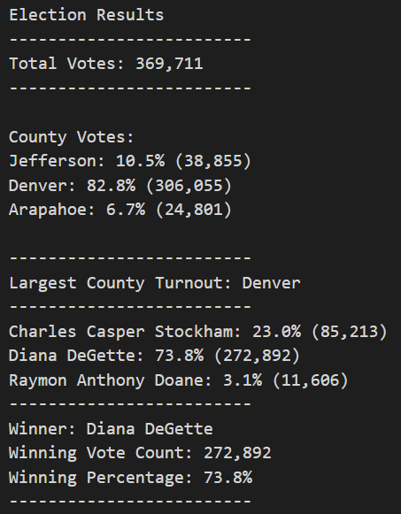

# Election_Analysis

## Project Overview
A Colorado Board of Elections employee has given you the following tasks to complete the election audit of a recent local congressional election.

1. Calculate the total number of votes cast.
2. Get a complete list of the candidates who received votes.
3. Calculate the total number of votes each candidate received.
4. Calculate the percentage of votes each candidate won.
5. Dtermine the winner of the election based on popular vote.

##Resources
- Data Source: election_results.csv
- Softwar: Python 3.7.6, Visual Studio Code, 1.52.1

## Summary
The analysis of the election show that:
- There were 369,711 votes cast in the clection.
- The candidates were:
    - Charles Casper Stockham
    - Diana DeGette
    - Raymon Anthony Doane
- The candidate results were:
    - Charles Casper Stockham received 23.0% of the vote and 85,213 number of votes.
    - Diana DeGette received 73.8% of the vote and 272,892 number of votes.
    - Raymon Anthony Doane 3.1% of the vote and 11,606 number of votes.
- The winner of the election was:
    - Diana DeGette, who received 73.8% of the vote and 272,892 number of votes.
    
## Challenge Overview
The chanllenge was to find the counties involved in the election and calculate the turnout of each county.
## Challenge Summary
- The county turnouts were:
    - Jefferson had 10.5% of the vote and 38,855 number of votes.
    - Dnever had 82.8% of the vote and 306,055 number of votes.
    - Jefferson had 6.7% of the vote and 24,801 number of votes.
- The county with largest turnout:
    - Denver, with 82.8% of the vote and 306,055 number of votes.
    

 
    
## Election Audit Summary
Coding was designed for to be able to reuse on other counties. The only input needed is the source file to have the same data points as ballot ID, county, candidate. We can modify the code to other regions such as municipal by altering the varibles. We can also modifiy the code to be use in historical data by including the year the elections took place or include the canidates party by adding another varible and include it into the calculations.
